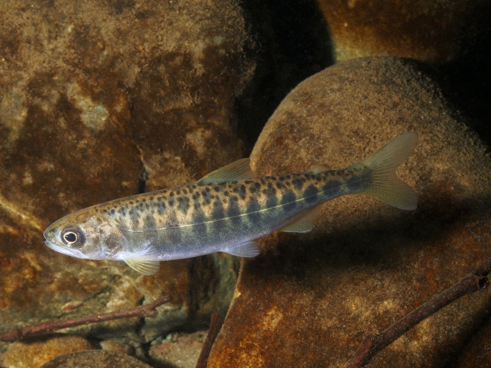

```{r setup, include=FALSE}
library(sf)
library(tidyverse)
library(ggspatial)
library(ggthemes)
library(patchwork)
library(tmap)
```

```{r,echo=FALSE,message=FALSE}

salmon_stomachs <- read_csv("~/Desktop/15/SDS264/projects/gwynniehayes.github.io/tabs/Data/Stomachs.csv") |>
  rename(latitude = `Start Latitude Decimal Degrees North`, 
         longitude = `Start Longitude Decimal Degrees West`,
         field_length_mm = `Salmon Field Length Millimeters`,
         lab_length_mm = `Salmon Lab Length Millimeters`,
         weight_g = `Salmon Lab Weight Grams`,
         prey = `Prey Item Common Name`,
         prey_life_stage = `Prey Item Life History Stage`,
         prey_item_count = `Prey Item Count`,
         prey_weight_g = `Prey Item Weight Grams`,
         salmon_id = `Salmon Id Number`) |> 
  select(`Transect Name`:`Prey Item Condition Description`, 
         -`Type Of Length`, 
         -`Length Description`,
         -`Transect Name`,
         -`Distance Offshore Nautical Miles`,
         -`Genus Species`,
         -`Tagged Code`,
         -`Tagged Description`,
         -`Station Depth Meters`,
         -`Station Code`,
         -`Start Time Local`
         )

  salmon_data_extra <- read_csv("~/Desktop/15/SDS264/projects/gwynniehayes.github.io/tabs/Data/Metrics.csv") |>
  filter(`Common Name` == "Chinook salmon") |>
  select(`Salmon Id Number`, 
         `Common Name`, 
         `Genetic Stock Best Estimate` : `Parentage Based Tag Probability`,
         -`Common Name`) |> 
    rename(salmon_id = `Salmon Id Number`, insulin_level = `Insulin Like Growth Factor One Nanograms Per Milliliter`) |>
    mutate(salmon_id = parse_number(salmon_id)) |>
    rename(hatchery = `Parentage Based Tag Hatchery Assignment`,
           hatchery_prob = `Parentage Based Tag Probability`) 

salmon_stomachs <- salmon_stomachs |>
  filter(prey_item_count < 50) |>
  mutate(prey_big = fct_collapse(prey, "Crabs" = c("CANCER", "CANCER ANT/GRAC", "CANCER OREG/PROD", "DUNGENESS CRAB", "GROOVED MUSSEL CRAB", "PEA CRABS", "PAGURIDAE", "PORCELLANIDAE"), 
                             "Fish" = c("ARROWTOOTH FLOUNDER", "BONY FISHES", "HERRINGS", "NORTHERN ANCHOVY", "RIGHTEYED FLATFISH", "SNAILFISHES", "WHITEBAIT SMELT", "ROCKFISH", "SAND SOLE", "PACIFIC SAND LANCE", "PACIFIC SANDDAB"), 
                             "Plankton/Crustaceans" = c("ATYLUS TRIDENS", "EUPHAUSIA PACIFICA", "EUPHAUSIIDAE", "HYPERIIDAE", "HYPEROCHE MEDUSARUM", "VIBILIA", "PHRONIMA SEDENTARIA", "THEMISTO PACIFICA", "THYSANOESSA SPINIFERA","PANDALIDAE", "COPEPODA", "CRUSTACEA", "DECAPODA", "ISOPODA"), 
                             "Cephalopods" = c("CEPHALOPODA", "RED OCTOPUS", "SQUIDS"), 
                             "Insect" = c("POLYCHAETA", "INSECT"), 
                             "Empty Stomach" = "EMPTY STOMACH", 
                             "Plant" = "PLANT", 
                             "Inorganic Material" = "UNIDENTIFIED MATERIAL")) |>
  mutate(prey_big = fct_collapse(prey_big, "Other" = c("Inorganic Material", "Insect", "Plant")))
  
big_wins_2 <- left_join(salmon_stomachs, salmon_data_extra, join_by(salmon_id))

```

```{r,echo=FALSE,message=FALSE}
hatchery_type <- big_wins_2 |>
  mutate(hatchery = ifelse(is.na(hatchery), 0, hatchery)) |>
  mutate(hatchery = fct_recode(hatchery, "Wild" = "0")) |>
  rename("Location" = "hatchery") |>
  mutate(Hatchery = fct_recode(Location, "Hatchery" = "RapidRiver", "Hatchery" = "Sawtooth", "Hatchery" = "McCall", "Hatchery" = "LyonsFerry", "Hatchery" = "Lookingglass", "Hatchery" = "Powell", "Hatchery" = "Pahsimeroi", "Hatchery" = "Dworshak", "Hatchery" = "Clearwater"))

```

# Introdution

In Washington State, salmon are a big part of the water's ecosystems and provide jobs and food to many people and animals. In elementary school most students spend time learning about the salmon cycle, even getting to raise their own fish. For this project we wanted to focus on something that was both interesting to us and held a bit of importance to our beloved home. Both of us were also intrigued by the prospect of this being someone's job, going out and collecting this data. Over the course of this project we looked at the many different kinds of food that these juvenile chinhook salmon ate, how big they were,where these fish came from, and comparing the fish from hatcheries in various parts of the Pacific Northwest to the fish that were born in the wild. We examined the correlatory differences in the prey from both these sets of fish and the size of these fish.



# Data

We found data on the NOAA Fisheries Northwest Fisheries Science Center website, that looked at the contents of fish stomachs, specifically Chinook Salmon. Each fish has an ID number with which we were able to join another dataset from NOAA that had the hatchery locations and measured insulin levels of the fish for extra exploration of how this affects their diet. We also did extensive filtering, selecting, renaming, and mutating of the variables to get the specific information that we wanted to look at, in the format that worked best for us. One major change we made to the dataset was to collapse the 42 unique food types into 6 easily understandable categories. Notable mentions are: Plankton and crustaceans were very difficult to parse, often overlapping greatly, so we just decided to combine them into one group. The 'Other' category is comprised of insects, plants, and inorganic materials.

Another note about our data, when we found the second data set that included the hatcheries of each of the fish the, fish not identified to a hatchery were just marked as NA, but from what we know about hatcheries and fish in we can assume that fish that were not specifically from a hatchery are from the wild.

```{r,echo=FALSE}
head(hatchery_type)
```

# Prey

First up, we wanted to start with a baseline of 2 different ways to count the number of prey eaten. The first graph the count of prey eaten by rows in the dataset, to show us what was the most popular food type in this group of salmon. The second graph shows counts the number of prey in the stomach of fish for each prey group that was found in the salmon to give us a better understanding of the quantities that they ate each food in.

```{r,echo=FALSE,fig.width=10,fig.height=5,fig.alt="plot 1 is a bargraph showing the quantities of each prey type (Crabs, Plankton/Crustaceans, Cephalopods, Fish, Other, and Empty Stomach), fish has the most entries, followed by crabs, plankton/crustacean, other, with empty and cephalopods having the least entries. Plot 2 is a boxplot, with the Y axis showing each of the prey types (Crabs, Plankton/Crustaceans, Cephalopods, Fish, Other, and Empty Stomach), and their Quantities the prey was eaten on the X axis. The medians are pretty close between each group (2 or 1),  many with several outliers, but crabs and plankton/crustaceans have the highest number eaten, at 2."}

g1 <- salmon_stomachs |>
    mutate(prey_big = fct_reorder(prey_big,prey_item_count)) |>
  ggplot(aes(y = prey_big)) +
  geom_bar() + 
  labs(x = "# of rows in dataset", y = "Type of Prey Consumed",title= "Number of Rows Each Food Type \nAppeared in the Dataset")  + 
  theme_linedraw()
 
g2 <- salmon_stomachs |>
  filter(prey_item_count < 50) |>
  mutate(prey_big = fct_reorder(prey_big,prey_item_count)) |>
ggplot() +
  geom_boxplot(aes(x = prey_item_count, y = prey_big)) +
  labs(x = "Amount of Prey Consumed", y = "\n\n\nType of Prey Consumed", title = "Type of Prey and the Amount Eaten", caption = "Data: https://www.webapps.nwfsc.noaa.gov/apex/parrdata/inventory/projects/project/858475") + 
  theme_linedraw()

g1 + g2

```

We see that fish are the most popular prey item for juvenile chinook salmon by far, followed, after a large drop, off by crabs and plankton/crustaceans.The second plot shows us that despite fish being the most popular food, they are not eaten in large quantities at once, unlike crabs and plankton, which hold a slight lead in that regard.

## Weight of Fish and Prey Type

In this second graph we are exploring how the weight of a salmon correlates with the type of food it eats.

```{r,echo=FALSE, fig.alt = "A boxplot, with the Y axis showing each of the prey types (Crabs, Plankton/Crustaceans, Cephalopods, Fish, Other, and Empty Stomach), and the X axis showing the weight of the fish in grams (ranging from ~15 to nearly 300). The heaviest median fish ~100 grams eat cephalopods, and plankton/crustaceans, with fish that eat other fish weighing a median of ~50 grams, Other + Crab eating fish weigh around 20 and 15, with the lightest median fish having empty stomachs."}
big_wins_2 |> 
  mutate(prey_big = fct_reorder(prey_big,weight_g)) |>
ggplot(aes(y = prey_big, x = weight_g)) +
  geom_boxplot() +
  labs(x = "Salmon Weight (grams)", y = "Type of Prey", title = "Weight of Salmon and the Type of Prey Consumed",caption = "Data: https://www.webapps.nwfsc.noaa.gov/apex/parrdata/inventory/projects/project/858475") + 
  theme_linedraw()
```

The fact that some of the heaviest fish ate plankton could be surprising, especially after cephalopods, a much more likely high median, is just above.

This graph is much like the previous one with all the same axes, though now the boxplots are split by fish that were raised in hatcheries vs. those in the wild.

```{r,echo=FALSE,message=FALSE,warning=FALSE, fig.alt = "A boxplot, just like the last one, with the Y axis showing each of the prey types (Crabs, Plankton/Crustaceans, Cephalopods, Fish, Other, and Empty Stomach), and the X axis showing the weight of the fish in grams (ranging from ~15 to nearly 300). This time we have split the boxplots into 2 by whether the fish were raised in the wild or in hatcheries. In every plot, the fish that were raised in the wild were significantly heavier on average than the hatchery fish, for example the median cephalopods are now 200 grams, compared to the hatcheries 25. The trends of median weight wild raised prey eaters were largely the same, with the exception of wild raised crab eating fish being heavier than their fish eating counterparts. The hatchery raised fish median weights for each category are nearly identical."}
hatchery_type |>
   mutate(prey_big = fct_reorder(prey_big, weight_g, .fun=median)) |>
 ggplot() +
  geom_boxplot(aes(x = weight_g, y = prey_big, fill = Hatchery), alpha=.25) +
  geom_boxplot(aes(x = weight_g, y = prey_big, color = prey_big, fill = Hatchery),
               alpha = .25 ,show.legend = FALSE) + 
  scale_color_colorblind() + labs(x= "Salmon Weight (grams)", 
                                  y = "Prey in Stomach", 
                                  fill = "Wild vs. Hatchery",
                                  title = "Weight of Salmon by Food Category Eaten \n Split by Hatchery or Wild Raised",
                                  caption = "Data: https://www.webapps.nwfsc.noaa.gov/apex/parrdata/inventory/projects/project/858475") + 
  theme_linedraw()
```

Interestingly, there is a strong correlation of wild fish being the heavier on average in all categories, and the hatchery raised median weights are much lighter, and nearly identical (\~25 grams) across all categories, implying much more homogeneity in their group.

## Length of Fish and Prey Type

For our last size based graph we wanted to explore the length of the fish with how they correlate to the prey type eaten as compared to the weight graphs above. We also wanted to explore a graph with much more complication, and analyze it on many levels.

```{r,echo=FALSE,warning=FALSE, fig.alt = "A boxplot, with the Y axis again showing each of the prey types (Crabs, Plankton/Crustaceans, Cephalopods, Fish, Other, and Empty Stomach), and the X axis showing this time the length of the fish in millimeters (ranging from ~75 to nearly 300).  The length of the fish equally correlates like weight to the cephalopod and plankton/crustacean eating fish having the highest median (~200 and 180 mm respectively) ,  followed by fish, other, crab, and empty stomachs being the smallest at ~ 140 mm. There is also an overlaid beeswarm plot, showing just the hatchery fish, which again shows that they are shorter on average than the overall group average. Lastly, the longest fish from each hatchery is marked in the beeswarm – Despite the fact that they are often outliers in their own hatchery group, they most often fall within the IQR of all fish, implying that even the largest hatchery fish are rather ordinary when compared to wild fish."}

library(ggbeeswarm)
big_hatchery_fish <- big_wins_2 |>
  drop_na(hatchery) |>
  group_by(hatchery) |>
  slice_max(lab_length_mm) |>
  relocate(hatchery,lab_length_mm) 
  
big_wins_3 <- big_wins_2 |>
  mutate(prey_big= fct_reorder(prey_big,lab_length_mm))

only_hatchery <- big_wins_2 |>
 drop_na(hatchery)


  ggplot() +
    geom_boxplot(data=big_wins_3, aes(y = prey_big, x = lab_length_mm)) + 
    geom_beeswarm(data=only_hatchery, aes(y = prey_big, x = lab_length_mm),color="gray",alpha=.5) + 
    geom_beeswarm(data=big_hatchery_fish, aes(y = prey_big, x = lab_length_mm,color=hatchery),size=3,show.legend = FALSE) + 
      theme_linedraw() +
    geom_label(data=big_hatchery_fish, 
               aes(y = prey_big, x = lab_length_mm,label=hatchery),
               nudge_x = 6, nudge_y = .3,size=2) +
    labs(x = "Length (millimeters)", y = "Prey in Stomach", title = "Length of Fish by Prey Eaten by Various Metrics",subtitle = "Boxplot = All Fish\nGrey dots = Just Hatchery Fish\nColored Dots = Biggest Fish from Each Hatchery",
         caption = "Data: https://www.webapps.nwfsc.noaa.gov/apex/parrdata/inventory/projects/project/858475")
  
```

There’s a lot going on in this graph, but also some pretty interesting takeaways. The overall boxplots show that length has the same correlation with prey type as weight. The light gray beeswarm dots show that the hatchery fish once again are shorter than the whole group. Finally, the colored dots show the longest fish grouped by each hatchery.

# Insulin Levels in Fish

Lastly, we wanted to explore the insulin levels in fish that was brought in with the location dataset. Insulin in salmon often helps decide the size of fish, so we wanted to explore how the two correlated in our dataset.

```{r,echo=FALSE,message=FALSE, warning = FALSE,fig.width=15,fig.height=5, fig.alt = "Scatterplots plots where the Y axis is the weight of the salmon (range from 0 - ~200). THe X axis is the insulin levels in the fish (range from ~25 to ~75), the second plot is then also faceted by the type of prey consumed (Fish, Crab, Plankton/Crustaceans, Cephalopods, Empty Stomach and Other). There is a positive coorelation between the insulin levels in the fish and the weight of the fish, that is evident in all of the differnt food types. However Cephalopods and empty stomach have a weaker coorelation then the rest of the prey types do. Lastly there is also a boxplot to show insulin levels in wild and hatchery raised fish. Wild Fish have a higher average level of insulin "}


p1 <- ggplot(big_wins_2,aes(x = insulin_level, y = weight_g)) +
      geom_point()  +
  geom_line(stat = "smooth", method = "lm", lwd = .75, color = "gray") +
  labs(x = "Insulin Level (ng per mL)", y = "Salmon Weight (grams)", title = "Insulin Levels in Salmon Versus the Weight of the Fish")


p2 <- big_wins_2 |>
  mutate(prey_big = fct_infreq(prey_big)) |>
ggplot() +
  geom_point(aes(x = insulin_level, y = weight_g, color=prey_big), show.legend=FALSE) + 
  geom_line(aes(x = insulin_level, y = weight_g), stat = "smooth",method = "lm", lty = 2, alpha = .7, lwd = .75)  +
  facet_wrap(~prey_big) +
  labs(x = "Insulin Level (ng per mL)", y = "\n\n\nSalmon Weight (grams)", title = "Insulin Levels in Salmon Versus the Weight of the Fish") + 
  theme_linedraw()


p1 + p2 + plot_layout(widths = c(4, 5))

ggplot(hatchery_type ,aes(x = insulin_level, y = Hatchery,fill=Hatchery)) +
      geom_boxplot(show.legend=FALSE,alpha=.2) + 
  labs(x = "Insulin Level (ng per mL)", y = "Hatchery vs. Wild", title = "Insulin Levels in Wild Raised and Hatchery Raised Salmon",
       caption = "Data: https://www.webapps.nwfsc.noaa.gov/apex/parrdata/inventory/projects/project/858475") + theme_linedraw()
```

In the first graph we see that there is an overall trend that more insulin leads to a heavier fish. A quick linear regression test reveals an intercept of 5.5 grams, with each ng per mL of insulin making a fish .7 grams heavier.

In the second graph we faceted by prey type, revealing that not all prey eaten correlate weight and insulin the same, further research would be needed to explore this further, but the lower slopes could be connected to outside factors, or even just a lack of data.

Lastly we see that the Insulin levels follow the same trend as size between the 2 groups of hatchery and wild salmon, wild have higher insulin on average.

# Map

Lastly, just for fun, we wanted to include a map of the Origin locations for each of the fish! Wild means they were not raised in a hatchery, while a name correlates to a hatchery somewhere across the pacific northwest

```{r,echo=FALSE,message=FALSE}
big_wins_sf <- st_as_sf(hatchery_type, coords = c("longitude", "latitude"), crs = 4326) 


tmap_mode("view")
 tm_basemap("Esri.WorldTopoMap") +
      tm_shape(big_wins_sf) +
      tm_dots("Location", size= 1) +
   tm_scalebar(position="left")
```

# Conclusion

The overall trend that we can see is that there seems to be correlation between insulin levels, size of fish is and then the kind of food it eats. This could be due to the insulin levels in fish regulating their metabolism, growth, and development and so that higher the insulin levels the fish have the more food that they need to eat to sustain themselves. We also see a trend that hatchery fish seem to be smaller wild ones in all cases, perhaps due to a protected development at an early stage of life they need less insulin and don't get as large, whereas the fish in the wild had to get stronger and bigger faster.
